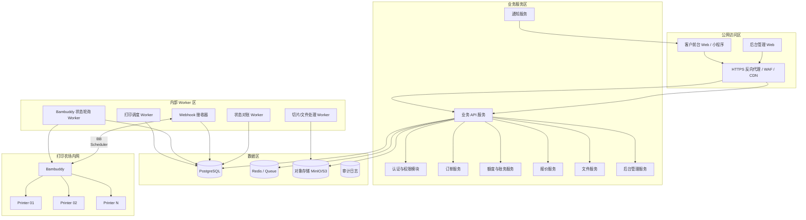
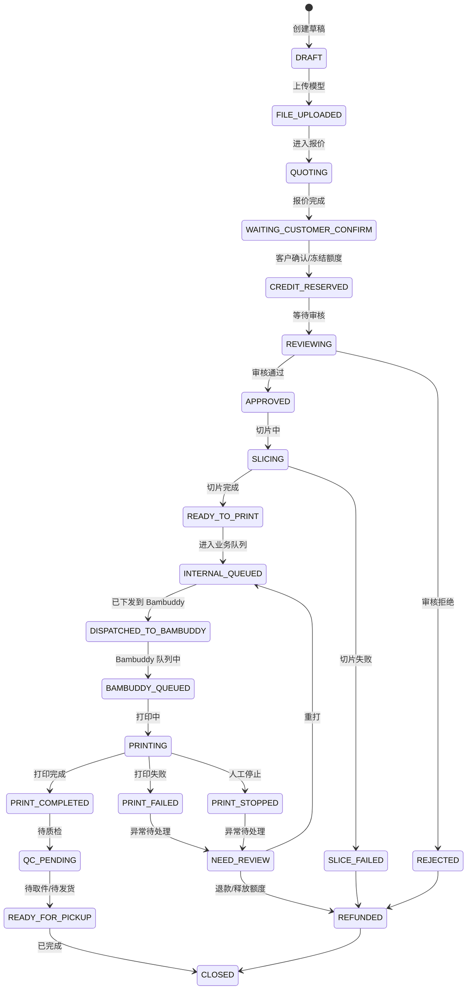
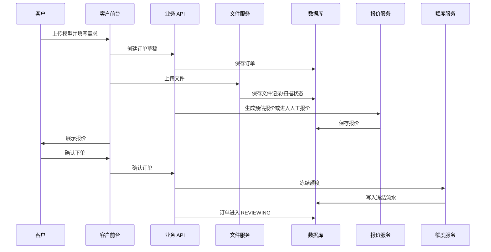
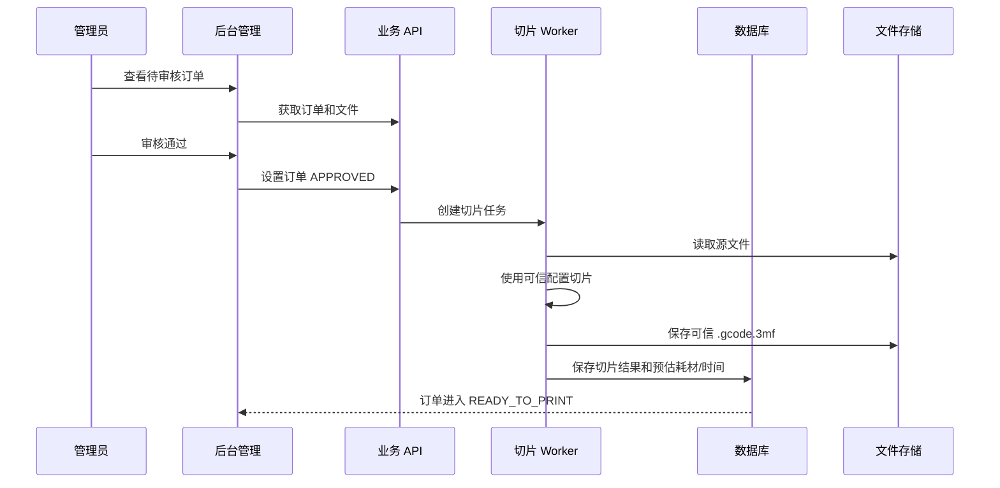
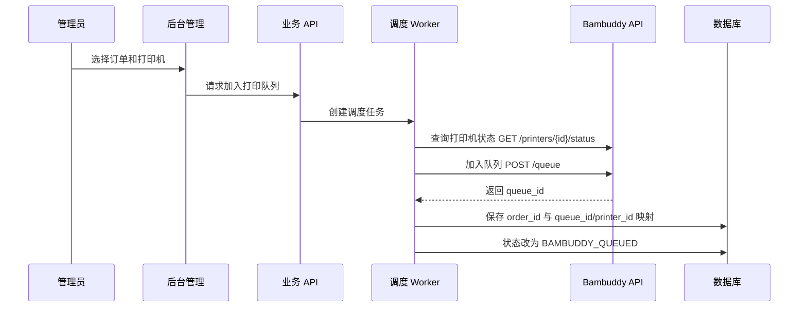
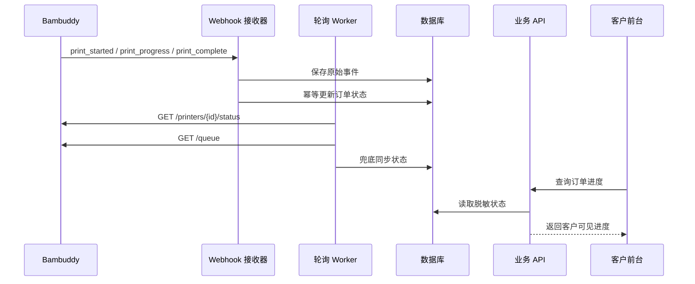
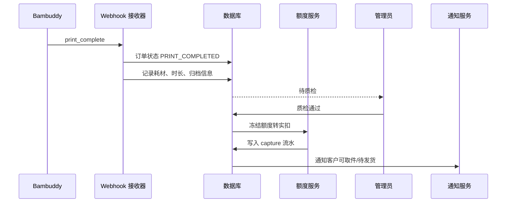
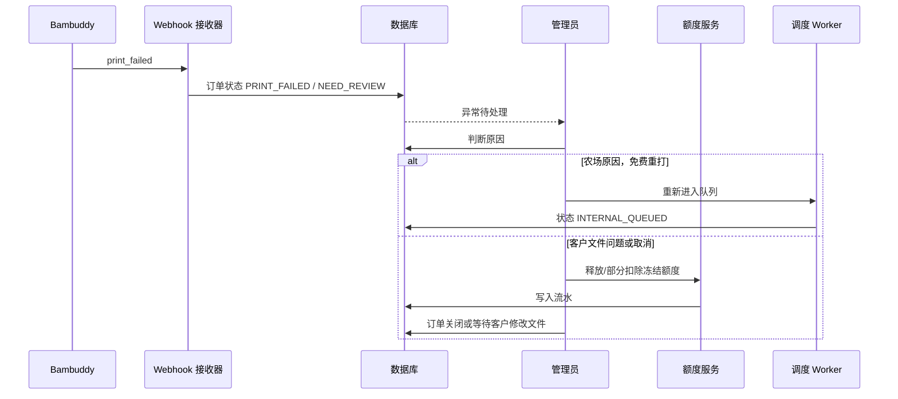

# 基于 Bambuddy API 的 3D 打印客户服务平台架构方案

> 文档版本：v1.0  
> 日期：2026-06-07  
> 适用场景：使用 Bambuddy 作为内部打印机管理与状态桥接层，在其上方建设独立的客户下单、额度、排队、进度查询和后台管理系统。  
> 重要原则：Bambuddy 只作为内部工具和打印机桥接层，不直接暴露给客户。

---

## 0. 结论先行

你的目标不是“把 Bambuddy 改造成客户网站”，而是建设一套独立的 **客户服务平台**，让 Bambuddy 承担下面这些内部能力：

- 读取打印机状态；
- 读取/管理内部打印队列；
- 获取打印归档、统计和必要的打印进度；
- 通过 Webhook 把打印开始、进度、完成、失败、离线、报错等事件推送给你的业务系统；
- 在后期自动化阶段，由内部调度器调用 Bambuddy 的队列/控制相关 API。

客户侧只接触你的业务系统：

- 用户注册、登录；
- 上传模型；
- 自助报价或提交报价请求；
- 额度冻结、扣除、退款；
- 查看自己的订单状态和脱敏后的打印进度；
- 接收完成、失败、异常处理通知。

客户不能接触：

- Bambuddy 管理面板；
- 打印机 IP、序列号、Access Code；
- Bambuddy API Key；
- 打印机摄像头原始流；
- 打印机控制接口；
- 农场完整队列；
- 其他客户的文件、订单和打印记录。

---

## 1. 已核验的 Bambuddy 能力与风险边界

以下是本方案实际依赖的 Bambuddy 能力。为了避免把未验证能力写死，所有自动化能力都分阶段设计，尤其是“文件上传、切片、自动开始打印”部分需要以你本地部署版本的 OpenAPI/API Browser 实测为准。

### 1.1 Bambuddy 的定位

Bambuddy 是一个自托管的 Bambu Lab 打印机管理系统，定位是本地、无云依赖的打印机管理中心。它适合放在内部网络里管理打印农场，但不适合直接作为客户门户开放。

### 1.2 REST API

Bambuddy 文档说明它提供 REST API，默认接口路径形式为：

```text
http://your-server:8000/api/v1
```

API Key 通过请求头传递：

```http
X-API-Key: your-api-key
```

本方案会使用 Bambuddy 作为 **内部 API 供应方**，由你的后端或内部 Worker 调用。

### 1.3 API Browser / OpenAPI

Bambuddy 文档说明它内置 API Browser，可以从 OpenAPI schema 加载接口，支持按分类查看、填写参数、执行请求和查看响应。

这点很关键：

- 开发前应先在 Bambuddy 自带 API Browser 里确认你当前版本的真实接口；
- 不要只依赖网上示例；
- 文件上传、切片、打印下发等自动化接口必须以本地 OpenAPI 实测结果为准。

### 1.4 本方案明确使用的 Bambuddy API 类型

| 能力 | Bambuddy API | 用途 | 客户是否可直接访问 |
|---|---|---|---|
| 打印机列表 | `GET /printers` | 内部同步打印机清单、状态总览 | 否 |
| 单台打印机详情 | `GET /printers/{id}` | 内部查看打印机详情、当前打印信息 | 否 |
| 单台打印机状态 | `GET /printers/{id}/status` | 同步进度、剩余时间、温度、HMS 状态 | 否 |
| 刷新状态 | `POST /printers/{id}/refresh-status` | 内部主动刷新状态 | 否 |
| 清除 HMS 错误 | `POST /printers/{id}/hms/clear` | 管理员/运维使用 | 否 |
| 清板确认 | `POST /printers/{id}/clear-plate` | 打印完成后由管理员确认清板 | 否 |
| 打印速度 | `POST /printers/{id}/print-speed?mode=N` | 内部运维控制 | 否 |
| 打印归档 | `GET /archives`、`GET /archives/{id}` | 匹配打印结果、材料消耗、历史记录 | 否 |
| 打印队列 | `GET /queue` | 同步内部打印队列 | 否 |
| 加入队列 | `POST /queue` | 后期半自动/自动调度使用 | 否 |
| 删除队列项 | `DELETE /queue/{id}` | 管理员调整内部队列 | 否 |
| 重排队列 | `POST /queue/reorder` | 管理员调整内部队列 | 否 |
| 统计 | `GET /statistics` | 后台经营统计、成本核算参考 | 否 |
| 摄像头快照 | `GET /printers/{id}/camera/snapshot` | 管理员查看，客户默认不开放 | 否 |
| 摄像头 MJPEG | `GET /printers/{id}/camera/stream` | 管理员查看，客户默认不开放 | 否 |
| 健康检查 | `GET /health` | 监控 Bambuddy 服务状态 | 否 |

### 1.5 Webhook

Bambuddy 支持向外部 URL 发送 Webhook。可用于：

- `print_started`：打印开始；
- `print_progress`：打印进度里程碑；
- `print_complete`：打印完成；
- `print_failed`：打印失败；
- `print_stopped`：手动取消；
- `printer_offline`：打印机离线；
- `printer_error`：HMS 错误。

Webhook 只作为“事件通知”，不要作为唯一事实来源。生产系统应采用：

```text
Webhook 实时事件 + 定时轮询兜底 + 数据库状态机校验
```

### 1.6 API Key 权限与版本要求

Bambuddy 的 API Key 权限应按最小权限拆分。文档中列出的权限包括：

- Read Status；
- Manage Queue；
- Control Printer；
- Manage Library；
- Manage Inventory；
- Allow Cloud Access；
- Update Electricity Price。

安全要求：

1. **生产环境要求 Bambuddy 版本不低于 `0.2.4.5`，或使用当前最新稳定版本。**  
   文档说明从 `0.2.4.5` 起，Bambuddy API 权限采用 allowlist 模型；旧版本曾存在 API Key 权限勾选项未完全限制实际接口的问题。

2. **至少拆成 3 类 API Key：**
   - `bb-readonly-status-key`：只读状态同步；
   - `bb-queue-key`：队列管理 Worker 使用；
   - `bb-control-key`：真正控制打印机的 Worker 使用，默认不启用，只有进入自动化阶段后才启用。

3. **不要给客户前端任何 Bambuddy API Key。**

4. **默认不要启用 Allow Cloud Access。**  
   除非你确实需要从 Bambu Cloud 读取预设、耗材目录或云端设备列表，否则不要给集成 Key 开云访问。

---

## 2. 总体架构

### 2.1 架构目标

本方案要实现：

- 客户可自助上传模型、提交订单、查看进度；
- 系统可做额度冻结、扣除、退款和流水记录；
- 后台可审核订单、报价、排队、分配打印机；
- Bambuddy 只在内部网络提供打印机状态、队列和事件；
- 打印机和 Bambuddy 不暴露到公网；
- 后期可逐步从人工/半自动过渡到自动排队与自动下发打印。

### 2.2 架构总览



### 2.3 核心边界

| 边界 | 原则 |
|---|---|
| 客户前台 ↔ 业务后端 | 只使用你的业务 API；不能访问 Bambuddy |
| 后台管理 ↔ 业务后端 | 后台管理员通过你的业务权限系统操作 |
| 业务后端 ↔ Bambuddy | 只允许内部 Worker 调用 Bambuddy API |
| Bambuddy ↔ 打印机 | 放在打印农场内网/VLAN |
| 公网 ↔ 打印农场 | 禁止公网直连；远程管理使用 VPN/Tailscale/ZeroTier/WireGuard |
| 客户文件 ↔ 打印机 | 客户上传文件必须审核/切片后才进入打印流程 |

---

## 3. 推荐部署拓扑

### 3.1 网络分区

建议至少分为三层：

```text
公网区 / DMZ
  - HTTPS 反向代理
  - 客户前台
  - 后台管理入口

业务服务区
  - 业务 API
  - Worker
  - 数据库
  - 对象存储
  - Redis

打印农场内网
  - Bambuddy
  - 拓竹打印机
  - 打印机只允许 Bambuddy / 指定 Worker 访问
```

### 3.2 最小部署形态

如果你只有一台服务器，也可以使用 Docker Compose 单机部署，但仍然要通过 Docker network 和防火墙隔离：

```text
server
├─ reverse-proxy          # 仅暴露 80/443
├─ customer-web           # 前台
├─ admin-web              # 后台
├─ api                    # 业务 API
├─ worker-poller          # Bambuddy 状态同步
├─ worker-webhook         # Webhook 接收
├─ worker-scheduler       # 打印调度
├─ postgres               # 数据库，禁止公网访问
├─ redis                  # 队列/缓存，禁止公网访问
├─ minio                  # 文件存储，禁止公网访问或仅内网访问
└─ bambuddy               # 内部网络访问，不向公网开放
```

### 3.3 Bambuddy 访问限制

强制规则：

- Bambuddy Web UI 不开放给客户；
- Bambuddy API 不开放给公网；
- 只有业务 Worker 所在 IP/容器网络可访问 Bambuddy API；
- 管理员远程访问 Bambuddy 使用 VPN/Tailscale；
- Bambuddy API Key 只存储在后端环境变量或 Secret Manager；
- 禁止把 API Key 写到前端代码、浏览器 LocalStorage、公开仓库。

---

## 4. 系统模块设计

### 4.1 客户前台

客户前台只处理客户自助服务，不包含任何打印机管理能力。

功能：

- 注册 / 登录；
- 查看额度余额；
- 上传模型；
- 选择材料、颜色、层高、数量、交付方式；
- 提交订单；
- 查看报价；
- 确认订单并冻结额度；
- 查看自己的订单列表；
- 查看自己的订单进度；
- 接收通知；
- 取消未进入打印阶段的订单；
- 下载发票/凭证，视业务需要。

客户看到的状态应是业务状态，不是 Bambuddy 原始状态。

示例：

```text
订单号：ORD-20260607-0001
状态：打印中
进度：46%
预计剩余：1 小时 20 分钟
材料：PLA 白色
预计消耗额度：32 点
当前说明：正在打印，完成后会进入质检。
```

不显示：

- 打印机真实 IP；
- 打印机序列号；
- Bambuddy printer_id；
- Access Code；
- 其他订单排队详情；
- 完整摄像头流；
- 内部文件路径；
- 内部队列顺序。

### 4.2 后台管理端

后台管理面向内部管理员、客服、操作员和财务。

功能：

- 用户管理；
- 额度充值、扣减、退款；
- 订单审核；
- 模型文件预览与审核；
- 报价；
- 队列管理；
- 打印机状态总览；
- 订单分配打印机；
- 手动绑定 Bambuddy archive_id / queue_id；
- 半自动加入 Bambuddy 队列；
- 异常处理；
- 失败重打；
- 质检结果录入；
- 完成通知；
- 成本统计；
- 操作审计。

### 4.3 业务 API 服务

业务 API 是唯一对外开放的后端入口，负责：

- 用户认证；
- RBAC 权限判断；
- 客户订单接口；
- 后台管理接口；
- 文件上传签名；
- 额度冻结与扣费；
- 订单状态查询；
- 对外通知。

业务 API 不应直接执行长时间任务。切片、同步、调度、对账等任务通过消息队列交给 Worker。

### 4.4 文件服务

职责：

- 接收客户上传文件；
- 存储原始文件；
- 计算 hash；
- 限制文件类型和大小；
- 病毒扫描；
- 模型基本解析；
- 生成预览图，视技术栈而定；
- 版本管理；
- 保存切片后的可信打印文件。

建议：

- 客户默认上传 STL、OBJ、STEP、普通 3MF；
- 不建议客户直接上传可打印 G-code 或 `.gcode.3mf`；
- 如果允许上传 3MF，必须区分“模型项目 3MF”和“带 G-code 的可打印 3MF”；
- 真正下发给打印机的文件必须由你的可信切片流程或管理员确认生成。

### 4.5 报价服务

报价可以先人工，后期半自动。

报价输入：

- 模型体积；
- 预计耗材重量；
- 预计打印时间；
- 材料类型；
- 颜色；
- 层高；
- 喷嘴规格；
- 支撑需求；
- 后处理；
- 失败风险系数；
- 加急系数；
- 订单数量。

额度公式示例：

```text
预估额度 = 基础开机费
         + 材料克重 × 材料单价系数
         + 预计打印小时 × 机时系数
         + 后处理费用
         + 风险/加急系数
```

生产建议：

- 下单时先冻结 `estimated_credit`；
- 打印完成后根据实际耗材/时间计算 `actual_credit`；
- 多退少补或按业务规则固定按预估扣费；
- 所有额度变化必须写入流水表。

### 4.6 额度与账务服务

核心原则：**额度不要直接修改余额，要通过流水驱动。**

典型动作：

- 充值：增加可用额度；
- 下单确认：冻结额度；
- 打印开始：保持冻结；
- 打印完成：冻结转实扣；
- 打印失败：释放冻结或部分扣费；
- 取消订单：释放冻结；
- 管理员调整：写入人工调整流水。

额度字段建议：

```text
available_credit  可用额度
frozen_credit     冻结额度
total_credit      available + frozen
```

不要只存一个 `balance`，否则很容易出现并发下单超扣、退款不清晰、失败重打无法追踪的问题。

### 4.7 订单服务

订单服务是系统核心，Bambuddy 只是其下游执行层。

订单应保存：

- 客户信息；
- 文件信息；
- 需求参数；
- 报价信息；
- 额度冻结信息；
- 业务状态；
- 打印状态；
- Bambuddy 映射；
- 通知记录；
- 操作日志。

### 4.8 Bambuddy Adapter

Bambuddy Adapter 是你的系统访问 Bambuddy 的唯一入口。

职责：

- 封装 Bambuddy REST API；
- 管理不同 API Key；
- 统一错误处理；
- 统一限流和重试；
- 屏蔽 Bambuddy 原始字段；
- 把 Bambuddy 状态映射为平台内部状态；
- 记录每次 API 调用日志。

不建议业务 API 到处直接调用 Bambuddy。否则后期换版本、换接口或替换 Bambuddy 时会非常痛苦。

### 4.9 状态轮询 Worker

职责：

- 定时调用 `GET /printers`；
- 定时调用 `GET /printers/{id}/status`；
- 定时调用 `GET /queue`；
- 必要时调用 `GET /archives`；
- 写入打印机状态快照；
- 更新订单进度；
- 检测离线、卡住、状态不一致。

建议频率：

| 数据 | 频率 | 说明 |
|---|---:|---|
| 打印中订单进度 | 10–30 秒 | 注意 Bambuddy API 读限流 |
| 空闲打印机状态 | 30–60 秒 | 不需要太频繁 |
| 队列 | 30–60 秒 | 用于后台展示和对账 |
| 归档 | 1–5 分钟 | 用于完成后补齐实际耗材/时间 |
| 健康检查 | 30 秒 | 检测 Bambuddy 是否可用 |

Bambuddy 文档中 API 限流示例为：读 100/min，写 30/min，控制 10/min。轮询必须按打印机数量计算，避免超过限制。

### 4.10 Webhook 接收器

职责：

- 接收 Bambuddy Webhook；
- 校验来源；
- 写入原始事件表；
- 做幂等处理；
- 推送状态变更任务到队列；
- 不在请求内做复杂业务处理。

Webhook 安全建议：

- 使用难猜的 URL，例如 `/internal/webhooks/bambuddy/{random_secret}`；
- 只允许 Bambuddy 内网 IP 访问；
- 如果部署跨网络，使用 mTLS、VPN 或反向代理访问控制；
- 如果 Bambuddy 当前 Webhook 不支持签名，就必须用来源 IP + secret path + HTTPS/VPN 补偿；
- 所有事件先落库，再异步处理；
- 重复事件不会重复扣费、重复完成订单。

### 4.11 打印调度 Worker

职责：

- 从业务订单队列读取可打印订单；
- 判断材料、颜色、喷嘴、打印尺寸、优先级、交期；
- 匹配可用打印机；
- 调用 Bambuddy 队列 API；
- 建立订单与 Bambuddy queue/archive/printer 的映射；
- 处理失败、取消、重试和重打。

建议分阶段：

- 初期只做“后台推荐打印机”，由管理员确认；
- 中期做“一键加入 Bambuddy 队列”；
- 后期再做“自动分配 + 自动排队 + 自动开始打印”。

### 4.12 切片/文件处理 Worker

职责：

- 模型格式转换；
- 切片；
- 生成 `.gcode.3mf`；
- 计算预估耗材和时间；
- 保存可信打印文件；
- 与订单、报价、Bambuddy 任务建立关联。

落地建议：

- 第一阶段：管理员本地使用 Bambu Studio/OrcaSlicer 切片后上传内部文件；
- 第二阶段：服务器端使用可信切片配置自动切片；
- 第三阶段：结合 Bambuddy 的集成切片能力或它的可用 API 自动进入队列。

注意：Bambuddy 文档确实宣传了集成切片和服务器端 sidecar，但本方案不假设所有切片/上传/打印下发接口都已稳定公开。开发时必须在本地 API Browser 中确认具体端点和权限。

---

## 5. 订单状态机设计

### 5.1 业务状态

建议订单使用清晰状态机，而不是简单字符串随便改。



### 5.2 客户可见状态

内部状态不要原样暴露给客户，建议映射为较少的客户状态：

| 内部状态 | 客户可见状态 |
|---|---|
| DRAFT | 草稿 |
| FILE_UPLOADED / QUOTING | 报价中 |
| WAITING_CUSTOMER_CONFIRM | 待确认 |
| CREDIT_RESERVED / REVIEWING | 等待审核 |
| APPROVED / SLICING | 准备打印 |
| READY_TO_PRINT / INTERNAL_QUEUED / BAMBUDDY_QUEUED | 排队中 |
| PRINTING | 打印中 |
| PRINT_COMPLETED / QC_PENDING | 已打印，质检中 |
| READY_FOR_PICKUP | 可取件/待发货 |
| PRINT_FAILED / PRINT_STOPPED / NEED_REVIEW | 异常处理中 |
| REJECTED | 无法打印 |
| REFUNDED | 已退款/额度已返还 |
| CLOSED | 已完成 |

### 5.3 Bambuddy 事件到订单状态的映射

| Bambuddy 事件 | 处理动作 |
|---|---|
| `print_started` | 找到对应订单，状态改为 `PRINTING`，记录开始时间 |
| `print_progress` | 更新订单进度、剩余时间；不改变核心业务状态 |
| `print_complete` | 状态改为 `PRINT_COMPLETED`，写入耗材、时长、归档信息 |
| `print_failed` | 状态改为 `PRINT_FAILED`，冻结额度暂不自动实扣，等待管理员处理 |
| `print_stopped` | 状态改为 `PRINT_STOPPED`，等待管理员确认原因 |
| `printer_offline` | 标记打印机异常，不一定立刻改订单失败 |
| `printer_error` | 标记订单/打印机异常，通知管理员 |

---

## 6. 订单与 Bambuddy 任务的绑定策略

这是整个系统最容易出问题的地方。必须设计明确的映射规则。

### 6.1 映射优先级

订单绑定 Bambuddy 任务时，建议按下面优先级匹配：

1. `archive_id`：最可靠；
2. `queue_id`：队列阶段可靠；
3. `printer_id + filename + started_at`：兜底；
4. 文件名中的唯一 `job_token`：兜底；
5. 管理员人工绑定。

### 6.2 文件命名规则

所有进入打印阶段的文件名都应包含内部订单标识：

```text
ORD-20260607-0001__v1__PLA-WHITE__0p20mm.gcode.3mf
```

命名规则：

```text
{order_no}__v{file_version}__{material}-{color}__{layer_height}.gcode.3mf
```

好处：

- Webhook 里如果只有 filename，也能反查订单；
- Bambuddy 归档列表里容易识别；
- 出现队列错配时容易人工排查。

### 6.3 映射表

建议建立 `bambuddy_jobs` 表：

| 字段 | 说明 |
|---|---|
| id | 内部主键 |
| order_id | 业务订单 ID |
| order_no | 业务订单号 |
| bambuddy_printer_id | Bambuddy printer id |
| bambuddy_queue_id | Bambuddy queue id |
| bambuddy_archive_id | Bambuddy archive id |
| filename | 打印文件名 |
| job_token | 唯一任务标识 |
| dispatched_at | 下发时间 |
| started_at | 打印开始时间 |
| completed_at | 完成时间 |
| bambuddy_status | Bambuddy 原始状态 |
| public_progress | 客户可见进度 |
| last_sync_at | 最后同步时间 |
| mapping_confidence | 映射可信度：exact / filename / manual |

---

## 7. 数据库设计

下面是建议的数据模型，不是最终 SQL，但字段已经按可落地方向整理。

### 7.1 用户表 `users`

| 字段 | 类型 | 说明 |
|---|---|---|
| id | uuid/bigint | 用户 ID |
| email | varchar | 邮箱 |
| phone | varchar | 手机号 |
| password_hash | varchar | 密码哈希 |
| name | varchar | 姓名/昵称 |
| role | varchar | customer/admin/operator/finance |
| status | varchar | active/disabled |
| created_at | timestamp | 创建时间 |
| updated_at | timestamp | 更新时间 |

### 7.2 额度账户表 `credit_accounts`

| 字段 | 类型 | 说明 |
|---|---|---|
| id | uuid/bigint | 主键 |
| user_id | uuid/bigint | 用户 ID |
| available_credit | decimal | 可用额度 |
| frozen_credit | decimal | 冻结额度 |
| currency_type | varchar | points/cny/custom |
| updated_at | timestamp | 更新时间 |

### 7.3 额度流水表 `credit_transactions`

| 字段 | 类型 | 说明 |
|---|---|---|
| id | uuid/bigint | 主键 |
| user_id | uuid/bigint | 用户 ID |
| order_id | uuid/bigint | 订单 ID，可为空 |
| type | varchar | recharge/freeze/capture/release/refund/adjust |
| amount | decimal | 金额/点数，正负都可 |
| before_available | decimal | 变更前可用额度 |
| after_available | decimal | 变更后可用额度 |
| before_frozen | decimal | 变更前冻结额度 |
| after_frozen | decimal | 变更后冻结额度 |
| reason | text | 原因 |
| operator_id | uuid/bigint | 操作人，可为空 |
| idempotency_key | varchar | 幂等键 |
| created_at | timestamp | 创建时间 |

### 7.4 订单表 `orders`

| 字段 | 类型 | 说明 |
|---|---|---|
| id | uuid/bigint | 主键 |
| order_no | varchar | 订单号 |
| user_id | uuid/bigint | 用户 ID |
| status | varchar | 内部状态 |
| public_status | varchar | 客户可见状态 |
| material | varchar | 材料 |
| color | varchar | 颜色 |
| layer_height | decimal | 层高 |
| nozzle_size | decimal | 喷嘴 |
| quantity | int | 数量 |
| estimate_weight_g | decimal | 预估耗材克重 |
| estimate_print_seconds | int | 预估打印时间 |
| estimated_credit | decimal | 预估额度 |
| frozen_credit | decimal | 已冻结额度 |
| actual_credit | decimal | 实扣额度 |
| priority | int | 优先级 |
| due_at | timestamp | 期望完成时间 |
| customer_note | text | 客户备注 |
| admin_note | text | 管理员备注 |
| created_at | timestamp | 创建时间 |
| updated_at | timestamp | 更新时间 |

### 7.5 订单文件表 `order_files`

| 字段 | 类型 | 说明 |
|---|---|---|
| id | uuid/bigint | 主键 |
| order_id | uuid/bigint | 订单 ID |
| file_type | varchar | source_model/sliced_file/preview |
| original_filename | varchar | 原始文件名 |
| storage_key | varchar | 对象存储路径 |
| content_type | varchar | MIME 类型 |
| size_bytes | bigint | 文件大小 |
| sha256 | varchar | 文件 hash |
| version | int | 文件版本 |
| scan_status | varchar | pending/clean/infected/error |
| created_at | timestamp | 创建时间 |

### 7.6 报价表 `quotes`

| 字段 | 类型 | 说明 |
|---|---|---|
| id | uuid/bigint | 主键 |
| order_id | uuid/bigint | 订单 ID |
| material_cost | decimal | 材料费用 |
| machine_time_cost | decimal | 机时费用 |
| service_cost | decimal | 服务费用 |
| post_processing_cost | decimal | 后处理费用 |
| risk_cost | decimal | 风险费用 |
| total_credit | decimal | 总额度 |
| status | varchar | draft/sent/accepted/rejected/expired |
| created_by | uuid/bigint | 报价人 |
| created_at | timestamp | 创建时间 |
| accepted_at | timestamp | 接受时间 |

### 7.7 打印机表 `printers`

这是你业务系统里的打印机抽象，不直接暴露 Bambuddy 原始信息。

| 字段 | 类型 | 说明 |
|---|---|---|
| id | uuid/bigint | 主键 |
| public_name | varchar | 客户可见名称，例如 Printer-03 |
| internal_name | varchar | 内部名称 |
| bambuddy_printer_id | int | Bambuddy printer id |
| model | varchar | 机型 |
| capabilities | jsonb | 尺寸、AMS、喷嘴、材料能力 |
| status | varchar | idle/printing/offline/error/maintenance |
| last_seen_at | timestamp | 最后在线时间 |
| enabled_for_auto_schedule | bool | 是否参与自动调度 |

### 7.8 Bambuddy 任务映射表 `bambuddy_jobs`

见第 6.3 节。

### 7.9 打印事件表 `print_events`

| 字段 | 类型 | 说明 |
|---|---|---|
| id | uuid/bigint | 主键 |
| order_id | uuid/bigint | 订单 ID |
| bambuddy_job_id | uuid/bigint | Bambuddy job 映射 |
| source | varchar | webhook/poller/admin |
| event_type | varchar | print_started/print_progress/... |
| raw_payload | jsonb | 原始事件 |
| normalized_payload | jsonb | 标准化事件 |
| idempotency_key | varchar | 幂等键 |
| created_at | timestamp | 创建时间 |

### 7.10 审计日志表 `audit_logs`

| 字段 | 类型 | 说明 |
|---|---|---|
| id | uuid/bigint | 主键 |
| actor_id | uuid/bigint | 操作人 |
| actor_type | varchar | customer/admin/system |
| action | varchar | 操作 |
| target_type | varchar | orders/users/credits/printers |
| target_id | varchar | 目标 ID |
| before | jsonb | 变更前 |
| after | jsonb | 变更后 |
| ip | varchar | IP |
| user_agent | text | UA |
| created_at | timestamp | 创建时间 |

---

## 8. 关键业务流程

### 8.1 客户下单流程



### 8.2 管理员审核与准备打印



### 8.3 半自动分配到 Bambuddy 队列



> 注意：`POST /queue` 的请求示例依赖 `archive_id` 和 `printer_id`。因此实际落地时，你需要先确认“切片后的可信文件如何进入 Bambuddy archive/library”这一环节。若当前版本的公开 API 不适配，应先采用管理员在 Bambuddy UI 中导入/选择文件，再由后台手动绑定 `archive_id`。

### 8.4 打印状态同步流程



### 8.5 打印完成与扣费流程



### 8.6 打印失败处理流程

失败不要自动扣费，也不要自动退款。建议进入人工处理。



---

## 9. Bambuddy API 集成设计

### 9.1 API Key 拆分

| Key 名称 | 权限 | 使用者 | 用途 |
|---|---|---|---|
| `bb-readonly-status-key` | Read Status | Poller / Reconcile | 读取打印机、队列、归档、统计、健康状态 |
| `bb-webhook-provider` | 不一定需要 Key | Bambuddy → 你的系统 | Webhook 推送 |
| `bb-queue-key` | Read Status + Manage Queue | Scheduler | 加入队列、删除队列项、重排队列 |
| `bb-control-key` | Read Status + Manage Queue + Control Printer | Scheduler/Operator Worker | 自动开始/暂停/清板等高风险操作 |
| `bb-library-key` | Manage Library | Slicer/File Worker | 上传或管理 Bambuddy Library，需本地确认接口 |

生产建议：

- 初期只启用 `bb-readonly-status-key`；
- 队列自动化上线后启用 `bb-queue-key`；
- 真正自动控制打印机前再启用 `bb-control-key`；
- 每个 Key 单独存储、单独轮换；
- 每个 Worker 只能拿到自己需要的 Key。

### 9.2 Bambuddy Adapter 示例接口

你的系统内部可以定义如下 Adapter，而不是让业务模块直接拼 Bambuddy URL。

```text
BambuddyAdapter
├─ list_printers()
├─ get_printer(printer_id)
├─ get_printer_status(printer_id)
├─ refresh_printer_status(printer_id)
├─ list_queue(filters)
├─ add_archive_to_queue(archive_id, printer_id, scheduled_time)
├─ remove_queue_item(queue_id)
├─ reorder_queue(queue_ids)
├─ list_archives(filters)
├─ get_archive(archive_id)
├─ get_statistics(filters)
├─ get_snapshot(printer_id)
└─ health_check()
```

### 9.3 轮询逻辑伪代码

```python
def sync_printer_statuses():
    printers = bambuddy.list_printers()

    for printer in printers:
        status = bambuddy.get_printer_status(printer["id"])
        save_printer_snapshot(printer, status)

        mapped_job = find_active_job_by_printer(printer["id"])
        if mapped_job:
            update_order_progress(
                order_id=mapped_job.order_id,
                progress=status.get("progress"),
                remaining_time=status.get("remaining_time"),
                raw_status=status,
            )

    queue = bambuddy.list_queue()
    reconcile_queue_with_internal_jobs(queue)
```

### 9.4 Webhook 处理伪代码

```python
def handle_bambuddy_webhook(payload):
    event = payload["event"]
    data = payload.get("data", {})

    idempotency_key = build_idempotency_key(payload)
    if event_already_processed(idempotency_key):
        return {"ok": True, "duplicate": True}

    save_raw_event(payload, idempotency_key)

    job = match_job(
        archive_id=data.get("archive_id"),
        printer_id=data.get("printer_id"),
        filename=data.get("filename"),
        timestamp=payload.get("timestamp"),
    )

    if not job:
        create_unmatched_event(payload)
        alert_admin("Bambuddy event cannot be matched to order")
        return {"ok": True, "matched": False}

    apply_event_to_order(job.order_id, event, data)
    return {"ok": True, "matched": True}
```

### 9.5 幂等键建议

Webhook 事件可能重复发送，轮询也可能和 Webhook 同时更新状态。建议幂等键：

```text
source + event + printer_id + archive_id + filename + timestamp
```

如果事件里没有 `archive_id`，使用：

```text
source + event + printer_name/printer_id + filename + progress + timestamp
```

关键业务动作必须另设幂等键：

- 冻结额度：`freeze:{order_id}:{quote_id}`；
- 实扣额度：`capture:{order_id}:{print_job_id}`；
- 退款：`refund:{order_id}:{reason_code}:{version}`；
- 加入队列：`dispatch:{order_id}:{sliced_file_id}:{printer_id}`。

---

## 10. 排队与调度设计

### 10.1 两套队列不能混为一谈

必须区分：

```text
业务订单队列：你的系统维护，面向客户、额度、交期、审核、优先级
Bambuddy 打印队列：内部执行队列，面向具体打印机和具体可打印文件
```

客户看到的是业务订单队列状态，不是 Bambuddy 队列全貌。

### 10.2 调度输入

调度器需要考虑：

- 订单优先级；
- 客户等级；
- 截止时间；
- 材料；
- 颜色；
- 喷嘴；
- 打印尺寸；
- 是否需要 AMS；
- 是否需要支撑；
- 打印机当前状态；
- 打印机维护状态；
- 当前材料余量；
- 失败率；
- 是否允许夜间打印；
- 是否需要人工清板。

### 10.3 调度策略分级

#### L0：纯人工

- 系统只做客户下单、额度、订单管理；
- 管理员手动在 Bambuddy 中打印；
- 后台人工更新状态。

适合：系统刚上线，先跑通业务。

#### L1：状态自动同步

- 管理员仍手动打印；
- 系统通过 Bambuddy Webhook/轮询同步打印状态；
- 后台人工绑定订单与 Bambuddy 任务。

适合：先解决客户看进度的问题。

#### L2：半自动调度

- 管理员在后台点击“分配到 Printer-03”；
- 系统调用 Bambuddy 队列 API；
- 自动建立映射；
- 打印进度自动同步。

适合：降低操作成本，但保留人工判断。

#### L3：全自动调度

- 系统自动选择打印机；
- 自动加入 Bambuddy 队列；
- 自动处理清板后续任务；
- 自动结算。

适合：模型标准化、材料标准化、失败处理流程成熟后。

### 10.4 推荐先做到 L2

L2 是性价比最高的阶段：

- 客户体验已经比较完整；
- 管理员仍能把控模型可打印性；
- 不需要一开始就完全解决自动切片、自动派单、自动失败重试；
- 风险远低于全自动。

---

## 11. 安全方案

### 11.1 不直接暴露 Bambuddy

禁止：

```text
客户浏览器 → Bambuddy
客户浏览器 → 打印机 IP
客户浏览器 → Bambuddy API
客户浏览器 → 摄像头流
```

允许：

```text
客户浏览器 → 你的业务 API → 数据库里的脱敏状态
内部 Worker → Bambuddy API → 打印机
```

### 11.2 客户权限

客户只能：

- 查看自己的订单；
- 上传自己的文件；
- 查看自己的额度；
- 确认自己的报价；
- 取消允许取消的订单；
- 查看自己的订单进度。

客户不能：

- 查看其他客户订单；
- 查看全局队列；
- 控制打印机；
- 查看打印机真实信息；
- 下载其他客户文件；
- 访问原始 Bambuddy 状态。

### 11.3 管理员权限

建议至少分角色：

| 角色 | 权限 |
|---|---|
| Customer | 客户自助功能 |
| Support | 查看订单、回复客户、不能扣费或控制打印机 |
| Operator | 审核模型、分配打印、处理失败 |
| Finance | 充值、退款、额度调整 |
| Admin | 用户、权限、系统配置 |
| System Worker | 内部服务账号，按职责持有最小权限 |

### 11.4 文件安全

必须做：

- 限制文件后缀；
- 限制文件大小；
- 保存 hash；
- 病毒扫描；
- 对用户文件做私有存储；
- 文件下载使用短期签名 URL；
- 客户之间文件隔离；
- 只让可信切片输出进入打印机。

建议不要让客户直接上传并打印 G-code，因为 G-code 可能包含不安全温度、运动、暂停、异常指令或不符合你机器配置的参数。

### 11.5 API 安全

- 全站 HTTPS；
- 后台启用 2FA；
- 管理接口做 IP 限制或 VPN；
- 所有写操作有 CSRF 防护或使用严格 SameSite Cookie；
- API 访问做限流；
- 关键操作写审计日志；
- 额度扣减必须幂等；
- Bambuddy API Key 不进前端、不进日志、不进报错返回。

### 11.6 Bambuddy API Key 轮换

建议：

- 每 90 天轮换；
- 发现泄露立即吊销；
- 按 Worker 拆 Key；
- 不同环境使用不同 Key；
- 开发、测试、生产隔离。

### 11.7 Webhook 安全

若当前 Bambuddy 版本未提供签名校验能力，应采用补偿措施：

```text
仅内网可访问 + 难猜 URL + 反向代理访问控制 + 原始事件落库 + 幂等处理
```

Webhook endpoint 不要直接暴露在公网，除非有强认证和来源限制。

---

## 12. 客户可见进度设计

### 12.1 不直接展示 Bambuddy 原始字段

Bambuddy 原始状态：

```json
{
  "state": "printing",
  "progress": 45,
  "remaining_time": 3600,
  "current_layer": 120,
  "total_layers": 267,
  "temperatures": {
    "nozzle": 220,
    "bed": 60,
    "chamber": 35
  },
  "hms_status": "ok"
}
```

客户展示：

```json
{
  "order_no": "ORD-20260607-0001",
  "status": "printing",
  "status_label": "打印中",
  "progress": 45,
  "remaining_time_label": "约 1 小时",
  "message": "订单正在打印，完成后会进入质检。"
}
```

### 12.2 进度更新策略

- 打印中订单：10–30 秒更新一次；
- 排队中订单：30–60 秒更新一次；
- 完成订单：不再轮询；
- Bambuddy 离线时：显示“状态同步延迟，管理员处理中”；
- 不向客户展示打印机错误细节，只展示“异常处理中”。

### 12.3 摄像头策略

默认不向客户开放摄像头。

原因：

- 可能拍到其他客户模型；
- 可能泄露农场布局；
- 可能引发客户对中途瑕疵的误判；
- 视频流会增加网络和安全压力。

如确实要开放，建议只开放：

- 当前订单专属打印机的低频快照；
- 打码/裁剪后的画面；
- 仅打印中显示；
- 管理员可关闭；
- 不开放 MJPEG 原始流；
- 不暴露 Bambuddy camera endpoint。

---

## 13. 接口设计：你的业务系统 API

### 13.1 客户 API

| 方法 | 路径 | 说明 |
|---|---|---|
| `POST` | `/api/auth/register` | 注册 |
| `POST` | `/api/auth/login` | 登录 |
| `GET` | `/api/me` | 当前用户 |
| `GET` | `/api/me/credits` | 查看额度 |
| `POST` | `/api/orders` | 创建订单草稿 |
| `POST` | `/api/orders/{id}/files` | 上传模型 |
| `GET` | `/api/orders/{id}/quote` | 查看报价 |
| `POST` | `/api/orders/{id}/confirm` | 确认订单并冻结额度 |
| `GET` | `/api/orders` | 查看自己的订单列表 |
| `GET` | `/api/orders/{id}` | 查看自己的订单详情 |
| `GET` | `/api/orders/{id}/progress` | 查看脱敏进度 |
| `POST` | `/api/orders/{id}/cancel` | 取消未进入打印阶段的订单 |

### 13.2 后台 API

| 方法 | 路径 | 说明 |
|---|---|---|
| `GET` | `/api/admin/orders` | 订单列表 |
| `GET` | `/api/admin/orders/{id}` | 订单详情 |
| `POST` | `/api/admin/orders/{id}/quote` | 报价 |
| `POST` | `/api/admin/orders/{id}/approve` | 审核通过 |
| `POST` | `/api/admin/orders/{id}/reject` | 审核拒绝 |
| `POST` | `/api/admin/orders/{id}/slice` | 创建切片任务 |
| `POST` | `/api/admin/orders/{id}/dispatch` | 分配到打印机 / 加入 Bambuddy 队列 |
| `POST` | `/api/admin/orders/{id}/bind-bambuddy` | 手动绑定 Bambuddy 任务 |
| `POST` | `/api/admin/orders/{id}/mark-qc-passed` | 质检通过 |
| `POST` | `/api/admin/orders/{id}/mark-failed` | 标记失败 |
| `POST` | `/api/admin/orders/{id}/refund` | 退款/释放额度 |
| `GET` | `/api/admin/printers` | 打印机状态总览 |
| `GET` | `/api/admin/bambuddy/queue` | 内部队列视图 |
| `POST` | `/api/admin/credits/adjust` | 额度调整 |

### 13.3 内部 API

| 方法 | 路径 | 说明 |
|---|---|---|
| `POST` | `/internal/webhooks/bambuddy/{secret}` | 接收 Bambuddy Webhook |
| `POST` | `/internal/jobs/sync-printers` | 触发状态同步 |
| `POST` | `/internal/jobs/reconcile` | 触发对账 |
| `POST` | `/internal/jobs/schedule` | 触发调度 |

内部 API 不应公网开放。

---

## 14. 前台页面结构

### 14.1 客户侧页面

```text
/customer
├─ /login
├─ /register
├─ /dashboard
├─ /credits
├─ /orders
│  ├─ /new
│  ├─ /{order_no}
│  └─ /{order_no}/progress
├─ /files
└─ /notifications
```

### 14.2 客户订单详情页

包含：

- 订单号；
- 当前状态；
- 进度条；
- 预计剩余时间；
- 材料和颜色；
- 额度信息；
- 文件版本；
- 客服备注；
- 时间线。

时间线示例：

```text
2026-06-07 10:15  已提交订单
2026-06-07 10:18  文件已上传
2026-06-07 10:30  报价完成
2026-06-07 10:35  已冻结 32 点额度
2026-06-07 11:20  审核通过
2026-06-07 12:05  已进入打印队列
2026-06-07 13:10  开始打印
```

---

## 15. 后台页面结构

```text
/admin
├─ /dashboard
├─ /orders
│  ├─ /pending-review
│  ├─ /quoting
│  ├─ /ready-to-print
│  ├─ /printing
│  ├─ /failed
│  └─ /{order_no}
├─ /queue
├─ /printers
├─ /bambuddy
│  ├─ /queue
│  ├─ /archives
│  └─ /health
├─ /users
├─ /credits
├─ /materials
├─ /profiles
├─ /reports
└─ /settings
```

后台订单详情页建议包含：

- 客户信息；
- 模型文件；
- 预览；
- 报价信息；
- 额度冻结；
- 审核记录；
- 切片结果；
- Bambuddy 映射；
- Webhook 事件；
- 状态快照；
- 操作审计；
- 异常处理按钮。

---

## 16. 自动化级别与落地路线

### 16.1 Phase 0：验证 Bambuddy 基础能力

目标：确认 Bambuddy 和 API 能用。

任务：

- 部署 Bambuddy；
- 加入至少一台测试打印机；
- 升级到 `0.2.4.5` 或更高版本；
- 创建只读 API Key；
- 在 API Browser 测试：
  - `GET /printers`；
  - `GET /printers/{id}/status`；
  - `GET /queue`；
  - `GET /archives`；
  - `GET /health`；
- 配置 Webhook 到测试接收器；
- 打一次测试模型，验证事件是否能匹配。

交付物：

- Bambuddy 可用；
- API Key 权限测试记录；
- Webhook 样例 payload；
- 本地 OpenAPI 导出或接口清单。

### 16.2 Phase 1：客户下单 + 额度 + 人工后台

目标：先把客户服务闭环跑起来，不碰打印机自动化。

功能：

- 客户注册登录；
- 上传模型；
- 人工报价；
- 额度冻结；
- 管理员审核；
- 手动状态更新；
- 客户查看订单状态。

特点：

- 风险低；
- 不依赖 Bambuddy 自动化；
- 可以先上线试运营。

### 16.3 Phase 2：Bambuddy 状态同步

目标：让客户能看到自动更新的打印进度。

功能：

- Poller 调用 `GET /printers/{id}/status`；
- Webhook 接收打印事件；
- 后台手动绑定订单与 Bambuddy 任务；
- 客户进度自动更新；
- 打印完成进入质检。

特点：

- 不自动控制打印机；
- 只读 Bambuddy 为主；
- 安全性较高。

### 16.4 Phase 3：半自动加入 Bambuddy 队列

目标：管理员在你的后台一键分配打印机和排队。

功能：

- 后台选择订单和打印机；
- 系统创建/选择 Bambuddy archive；
- 调用 `POST /queue`；
- 保存 `queue_id` / `archive_id` / `printer_id`；
- Webhook 自动更新进度。

前置条件：

- 本地确认当前 Bambuddy 版本如何通过 API 或稳定流程创建 archive/library 条目；
- 若没有稳定 API，则保留管理员在 Bambuddy UI 处理文件，后台只做绑定和状态同步。

### 16.5 Phase 4：自动切片 + 自动调度

目标：实现较完整自动化。

功能：

- 服务器端切片；
- 自动报价；
- 自动匹配材料和打印机；
- 自动加入队列；
- 自动结算；
- 失败自动重试策略。

上线条件：

- 模型品类标准化；
- 材料配置标准化；
- 切片配置稳定；
- 异常处理流程成熟；
- Bambuddy API 经充分测试；
- 有完整审计和回滚机制。

---

## 17. 运维与监控

### 17.1 需要监控的指标

业务指标：

- 每日订单数；
- 待审核订单数；
- 排队订单数；
- 打印中订单数；
- 失败订单数；
- 平均交付时间；
- 额度余额总量；
- 冻结额度总量。

打印指标：

- 打印机在线率；
- 打印机利用率；
- 成功率；
- 失败率；
- 平均打印时长；
- 材料消耗；
- 当前队列长度。

系统指标：

- API 延迟；
- 错误率；
- Webhook 接收失败；
- Poller 同步延迟；
- Bambuddy health；
- 数据库连接；
- Redis 队列积压；
- 文件扫描积压。

### 17.2 告警建议

应告警：

- Bambuddy `GET /health` 不健康；
- 某打印机离线超过 N 分钟；
- 打印中订单超过 N 分钟没有进度变化；
- Webhook 事件无法匹配订单；
- 额度流水幂等冲突；
- 文件扫描失败；
- 数据库备份失败；
- API Key 调用出现大量 401/403；
- Bambuddy API 返回 429 限流。

### 17.3 备份

至少备份：

- PostgreSQL；
- 对象存储；
- Bambuddy 数据；
- 配置文件；
- API Key 加密存储；
- 审计日志。

备份策略：

- 每日全量；
- 每小时增量，视订单量；
- 每月做恢复演练；
- 备份文件加密；
- 备份与生产机器分离。

---

## 18. 技术选型建议

### 18.1 稳妥型

适合快速落地：

```text
前端：Next.js / React
后端：FastAPI / Python
数据库：PostgreSQL
队列：Redis + RQ/Celery
对象存储：MinIO
反向代理：Caddy / Traefik / Nginx
部署：Docker Compose
```

优点：

- 开发快；
- 生态成熟；
- 对文件处理、后台任务、API 调用友好。

### 18.2 企业型

适合后期规模化：

```text
前端：Next.js
后端：NestJS / Spring Boot / FastAPI
数据库：PostgreSQL
队列：RabbitMQ / Kafka / Redis Streams
对象存储：S3 / MinIO
部署：Kubernetes
监控：Prometheus + Grafana
日志：Loki / ELK
```

### 18.3 当前建议

如果你现在还在验证商业流程，建议：

```text
Next.js + FastAPI + PostgreSQL + Redis + MinIO + Docker Compose
```

不要一开始上 Kubernetes，也不要一开始做全自动调度。

---

## 19. 最小可行产品 MVP

### 19.1 MVP 必须有

客户侧：

- 登录；
- 上传模型；
- 下单；
- 查看报价；
- 确认并冻结额度；
- 查看订单状态。

后台侧：

- 查看订单；
- 人工报价；
- 审核；
- 手动修改状态；
- 额度管理；
- 订单备注；
- 基础审计日志。

Bambuddy 集成：

- 只读打印机状态；
- Webhook 接收；
- 后台手动绑定订单和 Bambuddy 任务。

### 19.2 MVP 不建议有

- 客户摄像头；
- 客户直接选具体打印机；
- 客户直接上传 G-code 并打印；
- 全自动开始打印；
- 全自动退款；
- 完整多因子调度算法；
- 公网访问 Bambuddy。

---

## 20. 验收清单

### 20.1 安全验收

- [ ] Bambuddy 不可从公网访问；
- [ ] 客户前端源码不包含 Bambuddy API Key；
- [ ] 客户无法查看其他客户订单；
- [ ] 客户无法查看打印机 IP/序列号；
- [ ] 后台管理员启用 2FA；
- [ ] API Key 按最小权限拆分；
- [ ] Bambuddy 版本不低于 `0.2.4.5` 或使用最新稳定版本；
- [ ] 旧 Key 已删除并重建；
- [ ] Webhook endpoint 不公网裸露；
- [ ] 所有额度变更有流水；
- [ ] 所有关键操作有审计日志。

### 20.2 功能验收

- [ ] 客户可上传文件；
- [ ] 文件扫描状态可见；
- [ ] 管理员可报价；
- [ ] 客户确认订单后额度正确冻结；
- [ ] 管理员可审核订单；
- [ ] 管理员可绑定 Bambuddy 任务；
- [ ] Webhook 能更新订单状态；
- [ ] 轮询能兜底更新进度；
- [ ] 打印完成后订单进入质检；
- [ ] 质检通过后冻结额度转实扣；
- [ ] 打印失败不会自动误扣费；
- [ ] 退款/释放额度可追踪。

### 20.3 异常验收

- [ ] Bambuddy 离线时客户页面不崩溃；
- [ ] 打印机离线时订单进入异常提醒；
- [ ] Webhook 重复发送不会重复扣费；
- [ ] Webhook 无法匹配订单时进入人工处理；
- [ ] Bambuddy API 429 时 Worker 自动退避；
- [ ] 客户重复点击确认不会重复冻结额度；
- [ ] 管理员重复点击完成不会重复扣费。

---

## 21. 主要风险与应对

| 风险 | 说明 | 应对 |
|---|---|---|
| Bambuddy API 变化 | 开源项目版本迭代可能导致接口变化 | 封装 Adapter；上线前锁版本；用 API Browser/OpenAPI 生成测试 |
| API Key 权限误配 | 高权限 Key 泄露会影响打印机 | 最小权限拆 Key；Worker 隔离；定期轮换 |
| Webhook 丢失或重复 | 事件系统常见问题 | Webhook + 轮询；幂等处理；对账 Worker |
| 订单与打印任务错配 | 影响客户进度和扣费 | archive_id 优先；文件名带订单号；人工绑定兜底 |
| 用户上传危险文件 | 可能导致打印失败或安全风险 | 不直接打印用户 G-code；扫描；审核；可信切片 |
| 全自动过早上线 | 失败和纠纷成本高 | 先 L1/L2，成熟后 L3 |
| 客户看到过多内部信息 | 泄露隐私和运营信息 | 脱敏状态；不开放 Bambuddy；不展示完整队列 |
| 额度并发问题 | 多订单可能超扣 | 冻结额度；数据库事务；幂等键 |
| 打印失败责任不清 | 影响退款和客户体验 | 失败进入人工处理；记录原因；明确规则 |

---

## 22. 推荐开发顺序

1. 搭建 Bambuddy 测试环境；
2. 通过 API Browser 导出/确认接口；
3. 创建只读 API Key，验证状态读取；
4. 建立业务数据库；
5. 开发客户注册、登录、订单、文件上传；
6. 开发额度账户和流水；
7. 开发后台订单审核和报价；
8. 开发 Bambuddy Adapter；
9. 开发 Poller，同步打印机状态；
10. 配置 Webhook，开发 Webhook 接收器；
11. 开发订单与 Bambuddy 任务手动绑定；
12. 客户侧显示脱敏进度；
13. 开发半自动 dispatch；
14. 开发切片 Worker；
15. 开发自动调度。

---

## 23. 需要你后续确认的问题

这些不是阻塞项，但会影响详细实现：

1. 打印机数量、型号、是否都有 AMS；
2. 是否只做内部客户，还是面向公网客户；
3. 是否需要在线支付，还是只做内部额度；
4. 是否允许客户上传 STEP/OBJ/STL/3MF 的哪些格式；
5. 是否需要自动报价；
6. 是否需要客户看图片/快照；
7. 是否有取件、配送、发票流程；
8. 是否要多门店/多农场；
9. 是否要接入企业微信、飞书、邮件或短信通知；
10. 是否要与现有 CRM/ERP/库存系统对接。

---

## 24. 参考来源

- Bambuddy 官方站点：<https://bambuddy.cool/>
- Bambuddy GitHub：<https://github.com/maziggy/bambuddy>
- Bambuddy API Reference：<https://wiki.bambuddy.cool/reference/api/>
- Bambuddy API Keys & Webhooks：<https://wiki.bambuddy.cool/features/api-keys/>
- Tailscale 关于 Bambuddy 本地/远程访问的文章：<https://tailscale.com/blog/bambuddy-bambu-lab-3d-printer-access>

---

## 25. 最终建议

最现实、最稳的路线是：

```text
第一阶段：客户下单 + 额度 + 后台人工处理
第二阶段：Bambuddy 只读状态同步 + Webhook
第三阶段：后台手动绑定 / 半自动加入队列
第四阶段：自动切片与自动调度
```

不要一开始就做全自动，也不要把 Bambuddy 暴露给客户。  
Bambuddy 在这套架构里应该是内部“打印机连接与执行层”，你的客户服务平台才是业务主系统。
